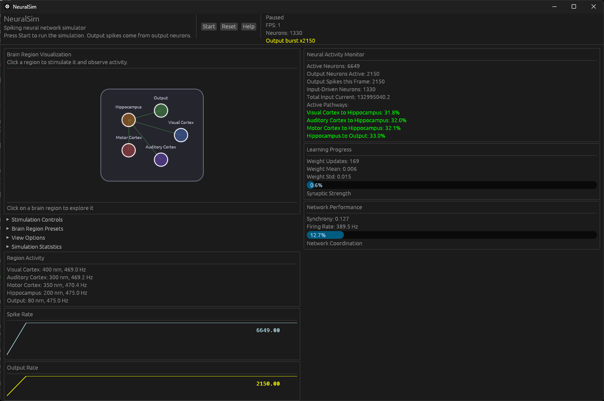

# NeuralSim

**Why I stopped dev**
*Honestly i'm kinda scared. What if there is a random chance that each time we run this code it births sentience and we kill it? Idk i'm scared. So imma stop this repo and forget about it...*

**A biologically realistic spiking neural network simulator built for massive scale.**

NeuralSim is a high-performance, massively scalable simulator for spiking neural networks (SNNs) that models individual neurons and their synaptic connections with biological fidelity. Each neuron is a discrete agent connected to one or more other neurons, forming complex, dynamic networks that mirror the architecture of real brains.



<details>
<summary>Nerdy Brain info</summary>

## Features

- **Single-neuron resolution** — Every neuron is an independent computational unit with membrane potential, firing threshold, refractory period, and multiple built-in models (LIF, Izhikevich, Hodgkin-Huxley)
- **Synaptic plasticity** — Spike-timing-dependent plasticity (STDP), triplet STDP, R-STDP (reward-modulated), BCM, short-term depression/facilitation, homeostatic scaling, intrinsic plasticity, and synaptic consolidation
- **Real brain architecture** — Modular brain regions (cortical columns, thalamocortical loops, hippocampus), configurable excitatory/inhibitory ratios (80/20), layer-specific connectivity patterns
- **Massive scalability** — Written in Rust with zero-cost abstractions, lock-free concurrency (rayon), and cache-friendly SoA memory layouts. Designed to simulate millions of neurons on consumer hardware
- **Bare-metal performance** — CSR adjacency matrices, split-borrow SoA parallel updates, optional GPU compute shader backend (wgpu)
- **Optional GUI** — Real-time visualization of network activity, spike raster plots, membrane potential traces, and interactive neuron inspection powered by `egui`
- **Deterministic simulation** — Reproducible results with seeded RNG for scientific use; seed recorded in checkpoint metadata
- **Serialization** — Save/load full network state (JSON), configurable checkpoints with pruning, CSV stats export, text↔spike I/O pipeline

## Architecture

```
┌─────────────────────────────────────────────┐
│                 GUI Layer                    │
│  (egui + brain visualization, optional)      │
├─────────────────────────────────────────────┤
│           Simulation Engine                  │
│  ┌─────────┐ ┌─────────┐ ┌───────────────┐ │
│  │Neuron   │ │Synapse  │ │Plasticity     │ │
│  │Models   │ │Dynamics │ │Rules (STDP,   │ │
│  │(LIF, HH,│ │(AMPA,   │ │BCM, triplet,  │ │
│  │Izhikevich)│GABA, NMDA)│ R-STDP, homeo) │ │
│  └─────────┘ └─────────┘ └───────────────┘ │
├─────────────────────────────────────────────┤
│         Data Layer (SoA, CSR, pools)        │
├─────────────────────────────────────────────┤
│     Parallel Runtime (Rayon + async IO)     │
├─────────────────────────────────────────────┤
│           Hardware Backend                  │
│  (CPU SIMD / optional GPU via wgpu)        │
└─────────────────────────────────────────────┘
```

### Neuron Models

| Model | Biological Fidelity | Performance | Use Case |
|-------|-------------------|-------------|----------|
| LIF | Medium | Highest | Large-scale simulation |
| Izhikevich | High | High | Balance of speed and realism |
| Hodgkin-Huxley | Highest | Moderate | Detailed biophysical study |

### Synapse Types

| Type | Time Scale | Function |
|------|-----------|----------|
| AMPA | ~2 ms | Fast excitation |
| GABA | ~10 ms | Fast inhibition |
| GABA-B | ~150 ms | Slow metabotropic inhibition |
| NMDA | ~100 ms | Slow excitation, voltage-gated (Mg²⁺ block), plasticity |

### Brain Region Templates

- Cortical column (6 layers, layer-specific connectivity)
- Thalamocortical loop
- Hippocampal formation (DG → CA3 → CA1)
- Custom user-defined regions via JSON/YAML config


## Performance Goals

| Scale | Neurons | Synapses | Memory | Performance Target |
|-------|---------|----------|--------|-------------------|
| Small | 10k | 1M | ~50 MB | >1000x realtime |
| Medium | 1M | 100M | ~2 GB | >10x realtime |
| Large | 100M | 10B | ~200 GB | ~1x realtime |

</details>

## Installation

### Build from source

```bash
# Clone and build
git clone https://github.com/Thenewchicken55/NeuralSim.git
cd NeuralSim
cargo build --release

# Run headless CLI demo
cargo run --release --no-default-features -- --cli

# Run with GPU acceleration
cargo run --release --no-default-features --features gpu -- --cli

# Run with GUI (default features)
cargo run --release
```

### Quick Example

See `examples/hello_brain.rs`, `examples/neuron_models.rs`, and `examples/stdp_learning.rs`
for more runnable examples.

## CLI

```sh
neural_sim                 # launch GUI (if built with the `gui` feature)
neural_sim --cli           # run the headless demo pipeline
neural_sim --cli --seed 7  # override the RNG seed
neural_sim --help          # full option list
```

## Research Foundations

NeuralSim is inspired by:
- **SpiNNaker** — Massively parallel neuromorphic architecture
- **Blue Brain Project** — Detailed cortical column reconstruction
- **BrainCog** — Multi-scale brain simulation framework
- **NeuroxAI** — GPU-accelerated SNN platform
- **Neuromod** — Rust SNN library with Hodgkin-Huxley dynamics
- **Neuropool** — Cache-friendly LIF neuron substrate

## License

Dual-licensed under [MIT](LICENSE-MIT) OR [Apache 2.0](LICENSE-APACHE).
